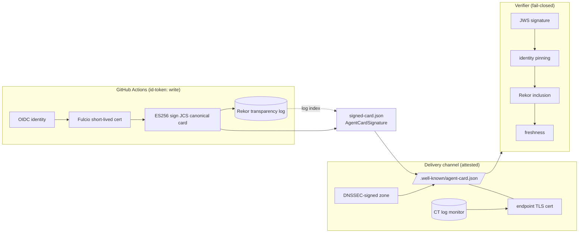

# Architecture

The trust chain runs sign → log → serve → verify. The differentiated part is
that the verifier's trust in the *delivery channel* is attested by DNSSEC and
Certificate Transparency, not only by the signed card bytes.

## The signature shape

`AgentCardSignature` is a detached-payload JWS:

- `protected` = base64url(`{"alg":"ES256"}`)
- signing input = `base64url(protected) || "." || base64url(JCS(card without signatures))`
- `signature` = base64url of the ES256 signature as JOSE `R||S` (64 bytes)
- `header.x5c` = the Fulcio (or self-signed, locally) certificate chain
- `header.rekorLogIndex` = the Rekor transparency-log index

## The JWS / Rekor seam

The spec's JWS shape carries the certificate naturally in `x5c`, but has no
native slot for a Rekor transparency-log pointer. We bind it in a custom
`rekorLogIndex` unprotected header field. Because Sigstore signs the artifact we
hand it (the JWS signing input) with ES256 over its SHA-256, the signature
Sigstore returns is directly usable as the detached JWS signature — no second
signing operation, and the same bytes are what Rekor logs.

## Why spec-native, not a wrapper

Emitting the v1.0 `signatures[]` / `AgentCardSignature` directly means any
spec-conformant A2A consumer can verify the card with no bespoke unwrapping step.
A tool-specific envelope (e.g. `{agentCard, verificationMaterial}`) would require
the consumer to understand that tool. See the README's "Why not `sigstore-a2a`".
